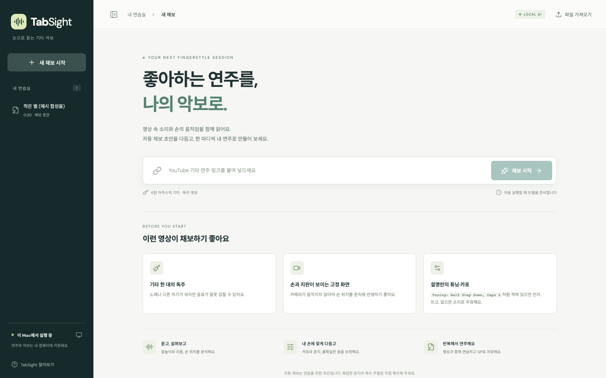
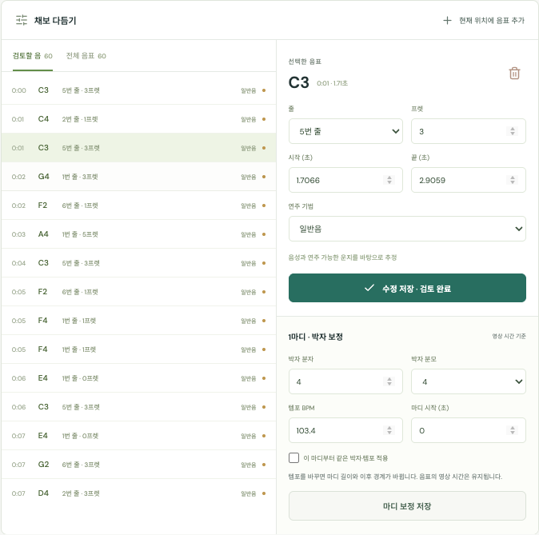
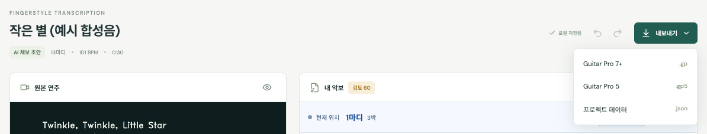

# TabSight

YouTube 핑거스타일 기타 연주를 **로컬 AI로 채보**하고, 초안을 고쳐 가며 연습하는 웹앱입니다.


## 주요 기능

<table>
  <tr>
    <td width="50%" valign="top">
      <b>링크 하나로 시작</b><br>
      YouTube 링크를 붙여 넣거나 영상·음성·GP 파일을 가져옵니다.<br><br>
      
    </td>
    <td width="50%" valign="top">
      <b>로컬 AI 분석</b><br>
      음표(GAPS)를 내 컴퓨터에서 분석하고, 연주 가능한 운지를 고릅니다.<br><br>
      
    </td>
  </tr>
  <tr>
    <td width="50%" valign="top">
      <b>음표 다듬기</b><br>
      확인이 필요한 음을 모아 보고 줄·프렛·길이·주법을 고칩니다.<br><br>
      
    </td>
    <td width="50%" valign="top">
      <b>튜닝·카포 보정</b><br>
      원래 음높이를 유지한 채 운지를 다시 계산합니다.<br><br>
      
    </td>
  </tr>
</table>

영상과 악보가 같은 위치를 따라가며, 원음·악보음 전환, 배속, A–B 반복으로 연습할 수 있습니다. 다 고친 악보는 Guitar Pro 파일(.gp, .gp5)로 내보냅니다.



<sub>화면 예시는 합성음으로 연주한 동요 '작은 별'을 실제로 분석한 결과입니다.</sub>

## 설치와 실행

macOS(Apple Silicon)에서 확인했습니다. `uv`, Node.js 22 이상, `ffmpeg`가 필요합니다.

```sh
brew install uv node ffmpeg
./TabSight.command
```

`TabSight.command`가 의존성 설치와 빌드를 마친 뒤 http://127.0.0.1:8787 을 엽니다. 처음 분석할 때 모델을 내려받으며, 추론은 모두 로컬에서 실행되어 API 키가 필요 없습니다. 서버에는 인증 기능이 없으니 외부 네트워크에 공개하지 마세요.

## 개발

```sh
uv sync --frozen && npm ci
.venv/bin/uvicorn server.app:app --host 127.0.0.1 --port 8787   # API 서버
npm run dev                                                     # 개발 화면 (5173)
.venv/bin/pytest -q && npm run build                            # 검사
```

브라우저 검사(`npm run test:e2e`, `npm run test:playback`)와 자세한 개발 안내는 [개발과 유지보수](docs/development.md)를 참고하세요.

## 참고

- 자동 채보 결과는 정답이 아닌 편집용 초안입니다. 운지·박자·주법은 직접 확인해 주세요.
- 프로젝트와 분석 결과는 `.data/`에 저장됩니다. `TABSIGHT_DATA_DIR`로 위치를 바꿀 수 있습니다.
- 자세한 문서: [구조와 동작](docs/architecture.md) · [알고리즘](docs/algorithms.md) · [연구와 모델](docs/research.md) · [검증과 한계](docs/validation.md)

## 라이선스

[MIT](LICENSE). 함께 들어 있는 `public/font/`의 Bravura 폰트(SIL OFL 1.1)와 `public/soundfont/`의 SONiVOX 사운드폰트(Apache-2.0)는 각 폴더의 라이선스를 따릅니다.
