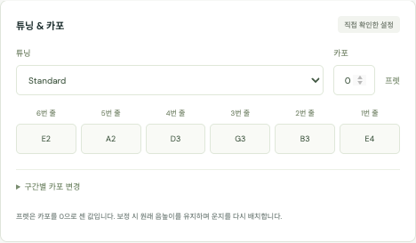

# 채보 알고리즘 상세

기준: 2026-09-27 구현. [README](../README.md) · [전체 처리 과정](architecture.md) · [연구 자료](research.md) · [검증과 한계](validation.md)

현재 시스템은 오디오 AI로 음표를 추론하고, 기타의 물리적 제약으로 운지를 선택한다. 영상은 원본 재생에만 쓰고 채보 계산에는 넣지 않는다(6절). 여기의 수치와 규칙은 현재 코드의 설정이며, 학습으로 최적화하거나 정확도 확률로 보정한 값은 아니다.

## 1. 모델과 규칙의 경계

| 단계 | 실제 사용하는 방법 | 출력 |
|---|---|---|
| 음표 추론 | GAPS 공개 기타 CRNN 체크포인트 | MIDI 음높이, onset, offset, velocity |
| 비트·마디 | librosa 비트 추적과 4박 묶기 | 마디 시작·끝, 템포 |
| 튜닝·카포 | 설명을 읽어 확인 화면을 미리 채우고, 채보 전에 사용자가 확인·입력. 음역 비용 비교는 제안에만 사용 | 6개 개방현 음높이, 기본·구간별 카포 |
| 줄·프렛 | 동시 음표 그룹 안에서 beam search | 각 음표의 줄과 상대 프렛 |
| 주법 | 길이, 세기, 스펙트럼, 음높이 이동 규칙 | 사용자 검토가 필요한 주법 후보 |
| 파일 출력 | 시간 양자화와 악보 구조 변환 | GP5 및 GP7 형식의 `.gp` |

GAPS는 줄·프렛을 직접 출력하지 않는다. 논문에서 검토한 TART·GuiFiR·Noise2Fret의 학습 모델을 현재 앱에서 실행하는 것은 아니다.

## 2. 오디오에서 음표 찾기

구현: [pipeline.py](../server/pipeline.py)의 `transcriptor`, `transcribe_audio`.

FFmpeg로 음성을 16kHz 모노로 변환한다. 모델은 `Regress_onset_offset_frame_velocity_CRNN`이며, 실제 가중치 파일은 `guitar-gaps-paper-version-12200_iterations.pth`다. CRNN은 합성곱과 순환 신경망을 조합하며, 여기서는 음 시작·끝·활성 프레임·세기 출력을 음표 이벤트로 변환한다.

현재 실행 설정은 다음과 같다.

| 설정 | 값 |
|---|---|
| 모델 출력 시간 해상도 | 초당 100프레임 |
| 음높이 클래스 수 | 88 |
| onset / offset / frame 임계값 | 0.35 / 0.30 / 0.15 |
| 모델 헬퍼의 segment 크기 | 160,000 samples, 16kHz에서 10초 |
| 앱이 나누어 전달하는 청크 | 20초, 양옆 최대 2초 문맥 추가 |
| batch size / PyTorch CPU threads | 1 / 4 |
| 유지하는 이벤트 | MIDI 35~96, 길이 0.06초 이상 |

예를 들어 두 번째 청크는 18~42초의 음성을 읽되, **시작 시각이 20초 이상 40초 미만인 음만** 채택한다. 이 규칙으로 겹치는 문맥에서 중복 검출된 onset을 제거한다. 청크 사이의 긴 잔향을 전체 곡에 걸쳐 이어 붙이는 별도 알고리즘은 없으므로 경계 근처의 긴 음 끝에는 한계가 있다.

MPS를 사용할 수 있으면 Apple GPU로 실행한다. 해당 장치에서 지원하지 않는 연산 등의 실행 오류가 발생하면 CPU로 옮겨 다시 계산한다. 체크포인트는 `weights_only=True`와 제한된 numpy 타입 허용으로 읽고 `strict=True`로 모델 구조를 확인한다.

초기 `confidence`는 onset 시점의 해당 음높이 `frame_output`을 0.2~0.95로 제한한 값이다. 이후 운지·주법 단계가 이 값을 낮출 수 있다. 음표 정답 확률을 직접 뜻하지 않는다.

## 3. 비트와 마디 만들기

구현: [pipeline.py](../server/pipeline.py)의 비트 추적, [music.py](../server/music.py)의 `build_bars`.

`librosa.onset.onset_strength`와 `beat_track`을 hop 256으로 실행한다. 추정한 기본 템포는 30~240 BPM 범위로 제한한다. 비트가 8개보다 많으면 앞뒤에 필요한 비트를 보충하고 4개 간격으로 묶어 4/4 마디를 만든다. 각 마디 템포는 `240 / 마디 길이(초)`를 20~300 BPM으로 제한한 값이다. 비트가 부족하면 기본 템포의 균일한 마디로 채운다.

이 단계는 마디의 첫 박을 별도 모델로 인식하지 않는다. 자동 3/4·6/8 판별, 못갖춘마디, 셋잇단음표, 멜로디/베이스 성부 분리도 하지 않는다. 사용자가 박자와 마디 경계를 보정할 수 있으며, 보정 후에도 원본 음표 시각은 유지한다.

## 4. 튜닝과 카포 정하기

구현: [music.py](../server/music.py)의 `metadata_settings`, `choose_settings`, [pipeline.py](../server/pipeline.py)의 `_prepare`·`_transcribe`, [Editors.tsx](../src/Editors.tsx)의 `SettingsConfirm`.

운지는 튜닝·카포에 따라 달라지지만 오디오만으로는 둘을 정할 수 없다(아래 음역 비교 참고). 그래서 채보를 시작하기 전에 사용자가 영상을 보며 확인하고, 설명에서 읽은 값은 확인 화면을 미리 채우는 데만 쓴다.

### 설명 정보

영상 설명에서 `tuning:` 또는 `tune=` 형태가 있는 첫 줄을 찾는다. 그 줄에서 알려진 튜닝 이름이나 `ADGCEA`, `D A D G A D`, `Eb Ab Db Gb Bb Eb` 같은 6개 음이름을 읽는다. 음이름에는 옥타브가 없으므로 각 줄의 Standard 음높이에서 8반음 아래부터 3반음 위 사이의 옥타브로 정한다. `Nashville`이 있으면 일반 기타는 6~3번 줄, 바리톤은 4·3번 줄을 한 옥타브 올린다. 카포는 같은 줄의 `capo 2`, `2 capo` 같은 표현을 먼저 보고, 없으면 `capo`가 들어간 다른 줄에서 찾는다. 설명 전체를 이해하는 언어 모델은 사용하지 않으므로 임의의 설명 형식은 놓칠 수 있다. 이 형식은 Sungha Jung 채널의 설명을 기준으로 만들었다. `Tuning - DADGAD`, 제목의 `(Drop D)`, 한국어·일본어 표기나 설명에 정보가 없는 영상(예: Osamuraisan)은 읽지 못하며, 그때는 확인 화면에서 직접 입력한다.

설명에 튜닝은 있고 카포가 없으면 카포 0으로 채운다. 여러 카포가 발견되면 숫자가 가장 작은 값을 채우고 구간별 카포를 추가하라고 안내한다. 변경 시각은 자동으로 알 수 없으므로 사용자가 영상을 그 시점으로 옮겨 구간별 카포를 지정한다.

### 채보 전 확인

영상 준비가 끝나면 채보하지 않고 `awaiting_settings`에서 멈춘다. 확인 화면은 설명에서 찾은 줄을 인용하고 채운 값을 보여 준다. 설명에서 튜닝을 찾지 못하거나 읽지 못하면 튜닝 칸을 비워 두고, 카포도 설명에 없으면 비워 둔다. 두 칸을 채워야 채보를 시작할 수 있으며 음역 추정값으로 대신 채우지 않는다. 가져온 영상·음성 파일은 설명이 없으므로 항상 직접 입력한다.

확인한 값은 채보 중 바뀌지 않는다. 다시 분석하면 지난번에 확인한 설정을 채워 두고 한 번 더 확인을 받는다.

### 음역 기반 제안

확인한 설정으로 배치하지 못한 음이 있으면 채보가 끝난 뒤 튜닝 후보와 비교한다. 더 맞는 튜닝이 있으면 경고와 튜닝·카포 패널의 제안(`불러오기`)으로만 보여 주고 설정은 바꾸지 않는다.

- 튜닝: 확인한 튜닝과 Standard, Half step down, Whole step down, Drop D, DADGAD, Open D, Open G, Open C.
- 카포: 확인한 기본 카포로 고정한다. 사용자가 설정할 수 있는 범위는 0~12프렛이다.
- 프렛: 카포 기준 0~24프렛.

일반 음의 가능한 운지는 아래 등식을 만족하는 모든 줄·프렛이다.

```text
midi = tuning[6 - string] + capo + fret
```

음표를 간격을 두고 샘플링한 뒤 튜닝마다 비용을 합산한다. 샘플 간격은 `max(1, 전체 음표 수 // 500)`이므로 정확히 500개로 제한하는 방식은 아니다.

```text
음표 비용 = 가능한 프렛 중 min(0.025 × fret + 눌러야 하는 음이면 0.05)
가능한 운지가 없으면 음표 비용 = 3

전체 비용 = 음표 비용의 합
          + 0.06 × capo
          + Standard가 아니면 0.1
          + 확인한 튜닝과 다르면 0.12 × 각 줄의 반음 차이 절댓값 합
```

비교는 길이 0.15초 이상인 연주 불가능 음이 샘플에서 `max(5, round(샘플 수 × 0.015))`개 이상일 때만 한다. 그보다 적거나 줄이 모자라 배치하지 못한 음만 있으면 제안하지 않는다. 카포를 고정한 비교이므로 경고와 제안에는 "카포가 맞다면"을 붙인다. 카포를 잘못 입력해도 튜닝 제안이 나올 수 있기 때문이다. 구간별 카포는 비교에 반영하지 않는다.

이는 낮은 프렛과 연주 가능성을 선호하는 휴리스틱이다. 오디오만으로 카포와 튜닝의 조합을 유일하게 확정할 수 없으며, 조성 추정이나 개방현 주파수 전용 분류기를 사용하지도 않는다. 카포 2에서 3프렛을 누른 소리와 카포 없이 5프렛을 누른 소리는 진동하는 줄 길이가 같아서 소리로는 구분되지 않는다. 영상으로 카포 집게나 이동 순간을 인식하는 기능도 없다. 이 때문에 이전처럼 설명이 없을 때 음역으로 튜닝·카포를 고르거나, 설명과 음역이 충돌할 때 튜닝을 자동으로 바꾸지 않는다.

## 5. 같은 음높이의 줄·프렛 고르기

구현: [music.py](../server/music.py)의 `candidates`, `assign_fingering`.

Standard, 카포 0에서 MIDI 64(E4)는 다음과 같이 여러 곳에서 난다.

| 줄 | 1 | 2 | 3 | 4 | 5 | 6 |
|---|---|---|---|---|---|---|
| 프렛 | 0 | 5 | 9 | 14 | 19 | 24 |

카포 2라면 같은 E4의 후보는 2번 줄 3프렛, 3번 줄 7프렛, 4번 줄 12프렛, 5번 줄 17프렛, 6번 줄 22프렛이다. 프렛은 카포에서부터 세므로 영상 속 실제 너트 기준 프렛과 2만큼 차이가 난다.

탐색 절차는 다음과 같다.

1. 타격음을 제외하고 음표를 시작 시각·음높이 순으로 정렬한다.
2. 그룹의 첫 음과 시작 차이가 45ms 이내인 음을 같은 동시 음표 그룹으로 묶는다.
3. 각 음의 가능한 줄·프렛을 나열한다. 같은 그룹에서는 한 줄을 두 번 사용할 수 없다.
4. 부분 배치의 비용이 낮은 24개만 남기며 다음 음을 배치한다. 이것이 beam search다.
5. 그룹의 최저 비용 배치를 채택하고, 양수 프렛들의 중앙값을 다음 그룹의 손 위치 기준으로 사용한다. 최초 기준 위치는 3프렛이다.

일반 운지의 개별 비용은 다음과 같다. `previous_position`은 앞 그룹에서 정한 손 위치다.

```text
local = 0.06 × fret + 0.12 × abs(max(1, fret) - previous_position)
개방현이면 local에서 0.25를 뺀다.
```

부분 화음에서 누르는 프렛의 최대-최소 차이가 5를 넘으면, 초과 프렛당 1.4의 비용을 추가한다. 이 비용은 각 부분 배치를 확장할 때 적용된다. 낮은 위치, 작은 손 이동, 지나치게 넓지 않은 화음을 선호하도록 만든 규칙이다.

탐색은 **한 동시 음표 그룹 내부**에서 이루어진다. 곡 전체를 대상으로 최적 경로를 찾는 Viterbi나, 앞으로 나올 여러 마디를 미리 고려하는 운지 모델은 아니다. 이전 음의 잔향과 다음 그룹의 줄 점유도 완전히 함께 최적화하지 않는다.

불가능한 음이나 배정할 줄이 부족한 음은 MIDI를 유지하고 `string=0`, `confidence=0.1`로 남긴다. 음을 삭제하거나 다른 높이로 바꾸어 문제를 숨기지 않는다.

### 튜닝·카포를 직접 바꿀 때

채보 전에 확인한 설정도 결과를 원음과 비교하며 다시 바꿀 수 있다. 설정을 고치는 동안 화면이 새 설정의 음역을 벗어나는 음의 수와 원인(가장 낮은 줄보다 낮은 음, 24프렛보다 높은 음)을 바로 보여 준다. 줄의 옥타브를 잘못 고른 경우가 여기서 드러난다. 채보 결과에 튜닝 제안이 있으면 같은 패널에서 `불러오기`로 입력란에 채운 뒤 이 미리 보기를 확인하고 적용한다.



적용하면 배치할 수 있는 음은 새 설정으로 다시 배치하고, 나머지는 음높이를 유지한 채 운지 미정으로 남겨 검토할 음 목록 맨 위에 모은다. 실행 취소로 되돌릴 수 있다. 새 튜닝에 자연 하모닉스 자리가 없는 하모닉스 음은 일반 음으로 배치하고 하모닉스 후보로 표시한다. API를 `allow_unplayable` 없이 호출하면 이전처럼 거절하고 원인을 알려 준다.

## 6. 영상을 운지에 쓰지 않는 이유

2026-09-27에 손 검출(MediaPipe)과 지판 인식(자동 검출·수동 보정)을 제거했다. 영상은 원본 재생과 악보 동기화에만 쓴다. 제거 전 측정 결과는 다음과 같다.

- **자동 지판 검출**: 영상 4개를 10fps로 분석했을 때 지판을 찾은 프레임이 0.08~1.75%였다. 찾은 지판의 40%는 줄 순서가 뒤집혔고, 너트가 실제 위치에서 중앙값 8~20프렛 벗어나 검증 가능한 87개 중 쓸 수 있는 것이 없었다.
- **정확한 지판을 직접 넣은 경우**: 레퍼런스 악보가 있는 2곡 중 카포 2 곡은 58%→66%로 올랐고, 카포 5 곡은 98%→85%(피킹 손 제외 시 92%)로 떨어졌다. 바뀐 음은 거의 모두 개방현과 누른 음 사이의 선택이었다. 손가락이 다른 자리에 있으면 개방현이 불리해지는 구조라서 곡의 운지 습관에 따라 결과가 갈렸다.
- **같은 음이 다른 자리에서 나는 경우**: 카포 2 곡에서 4~5프렛 떨어진 자리를 잘못 고른 30개를 하나도 고치지 못했다. 21개는 쓸 수 있는 손끝 관측이 없었고, 9개는 영상도 같은 틀린 자리를 가리켰다.
- **관측 정밀도**: 손끝이 실제 프렛 ±1 안에 있는 비율은 80~83%였지만, 줄 방향으로 0.5줄 안에 드는 비율은 15~18%였다.

채점한 음은 곡당 150~165개(레퍼런스의 13~14%)라 정밀한 수치는 아니다. 영상을 다시 쓰려면 손가락이 어느 줄을 누르는지까지 판별하는 학습 모델이 필요하다. 제거한 구현은 커밋 `49469bf`에 있다.

## 7. 주법 후보

구현: [music.py](../server/music.py)의 `suggest_techniques`. 모든 자동 주법은 사용자가 원본과 비교할 후보다. 다성 음원을 개별 현의 소리로 분리한 다음 분석하는 방식은 아니어서 화음과 잔향에 영향을 받는다.

| 주법 | 현재 규칙의 핵심 | 주요 한계 |
|---|---|---|
| 해머온·풀오프 | 같은 줄의 연속 음, 앞 음 끝과 다음 onset 차이 -80~60ms, 프렛 차이 1~4. onset 25ms RMS가 직전 30ms RMS의 1.35배 미만 | 작은 피킹도 비슷하게 보일 수 있음. 연결의 출발 음에 표시 |
| 팜 뮤트 | 일반 음의 길이가 90ms 미만 | 짧은 보통 음과 혼동 가능 |
| 자연 하모닉스 | 길이 180ms 이상, MIDI 72 이상, 가능한 자연 하모닉스 위치가 있고 2·3·4배음 대역 세기 합/기본음 세기가 0.28 미만 | 혼합 스펙트럼에서의 단서일 뿐 확정 기준이 아님 |
| 슬라이드 | 같은 줄의 2반음 이상 이동, 다음 음 주변 짧은 구간에서 YIN 음높이가 대체로 한 방향으로 이동 | 다성음·짧은 슬라이드에 취약. 출발 음에 표시 |
| 슬랩·바디 타격 | spectral flux의 큰 피크와 spectral flatness 0.06 이상 | 가까운 일반 음이 있으면 슬랩, 없으면 별도 타격 후보. 강한 피킹과 혼동 가능 |
| 벤딩·비브라토 | 사용자가 편집기로 지정 | 현재 자동 검출 규칙 없음 |

하모닉스는 기존 줄에서 가능한 터치 프렛이 있을 때만 자동으로 운지를 바꾼다. 다른 줄로 이동해야 한다면 운지를 유지하고 `harmonic-candidate` 근거를 남긴다. 미검토 상태의 이 후보는 파일에 `Harmonic?` 메모로 표현한다.

지원하는 자연 하모닉스의 터치 프렛과 개방현 대비 MIDI 간격은 다음과 같다. 실제 배음의 미세한 음정 차이는 MIDI 반음으로 근사한다.

| 터치 프렛 | 3 | 4 | 5 | 7 | 9 | 12 |
|---|---|---|---|---|---|---|
| 반음 간격 | 31 | 28 | 24 | 19 | 28 | 12 |

타격 후보는 MIDI 37, 길이 0.1초의 별도 이벤트로 저장한다. 기타 소리에서 정확한 타격 종류를 분류한 결과는 아니다.

## 8. 검토 표시와 측정값 해석

운지를 배정하면 `confidence`를 기존 값과 0.58 중 작은 값으로 바꾼다. 주법 후보의 상한은 종류에 따라 0.2~0.4 수준이다.

화면의 기본 검토 대상은 `confidence < 0.65`이고 `reviewed=false`인 음이다. 자동으로 배정한 음은 모두 이 조건에 들어가므로 처음에는 전체 음이 검토 대상이다. 이는 검토 우선순위이며, “58% 확률로 정답”이라는 의미가 아니다.

- `unassigned`: 현재 튜닝·카포로 배치할 수 없어 운지를 비워 둔 음 수.
- `accuracy_verified`: 자동 분석에서는 `false`. 사용자 기준 악보와 실제 정답을 비교했다는 뜻으로 바꾸지 않는다.

이전 버전으로 분석한 프로젝트에는 `hand_detection_rate`, `changed_by_vision` 같은 영상 집계와 음표의 `vision` 근거가 남아 있을 수 있다. 현재 앱은 이 값을 표시하거나 계산에 쓰지 않는다.

## 9. 초 단위 음표를 GP 파일로 바꾸기

구현: [export.py](../server/export.py)의 `gp5_bytes`, [score-bridge.mjs](../scripts/score-bridge.mjs).

1. 음높이·운지 일치, 미정 운지, 마디 밖 onset, 양자화 후 같은 줄의 onset 충돌을 검사한다. 실제 내보내기는 문제를 알리고 중단한다.
2. 카포 값별로 기타 트랙을 만들고 해당 카포 구간의 음을 배치한다. 바디 타격은 별도 퍼커션 트랙으로 보낸다.
3. 같은 물리적 줄의 다음 음이 시작하면 이전 음의 끝을 출력용으로 줄인다. 프로젝트의 원래 `end` 값은 보존한다.
4. 마디 안의 상대 시간을 tick으로 변환하고 60tick 단위로 반올림한다. 4분음표 960tick, 온음표 3840tick이므로 60tick은 64분음표다. 120 BPM이면 약 31.25ms에 해당한다.
5. 시작·끝 경계마다 구간을 나누고 음가·쉼표·화음·타이로 구성한다. 각 트랙의 활성 성부는 하나다. 멜로디·베이스를 서로 다른 성부로 추론하지 않는다.
6. PyGuitarPro로 GP5 5.1을 쓴다. `.gp` 요청은 GP5를 alphaTab으로 읽고 `Gp7Exporter`로 다시 쓴다.

템포는 GP에 기록할 때 정수 BPM으로 반올림한다. 셋잇단음표를 별도로 복원하지 않으며, 세밀한 타이와 짧은 음가가 많이 생길 수 있다. 원본 시각 보존과 보기 좋은 리듬 표기는 서로 다른 과제로 남아 있다.

미리보기는 운지가 미정인 음 등을 제외하고 렌더링할 수 있도록 일부 검사를 생략한다. 다운로드는 더 엄격하게 검사한다. JSON 내보내기에 원본 시각·미정 음·근거가 남는다. 실제 파일 검증 범위와 Guitar Pro 데스크톱 앱에서 확인하지 못한 부분은 [검증 문서](validation.md)에 기록했다.
