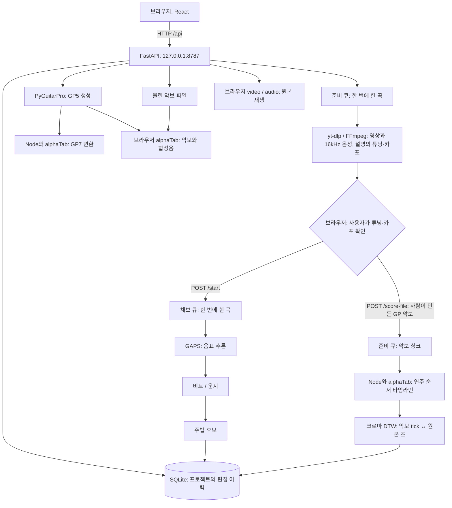
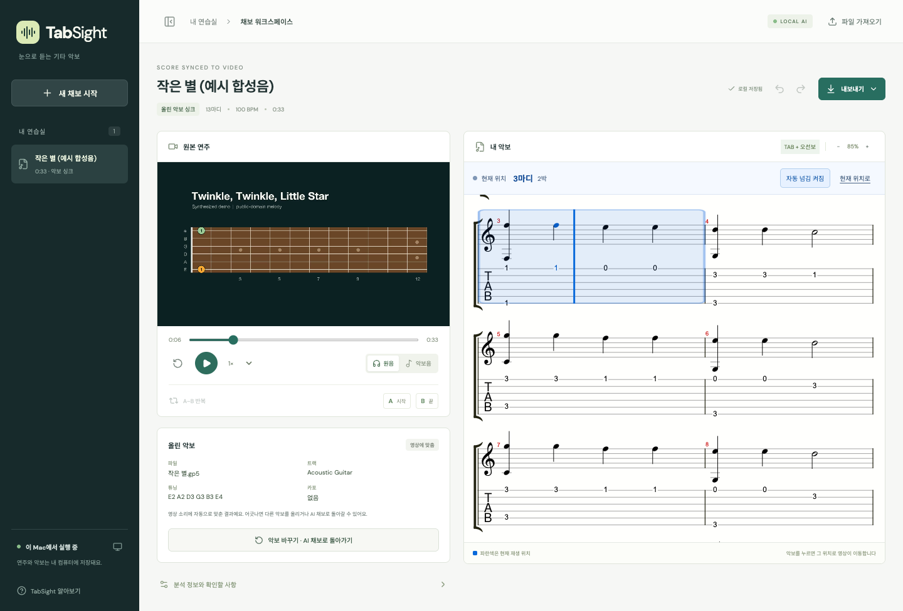
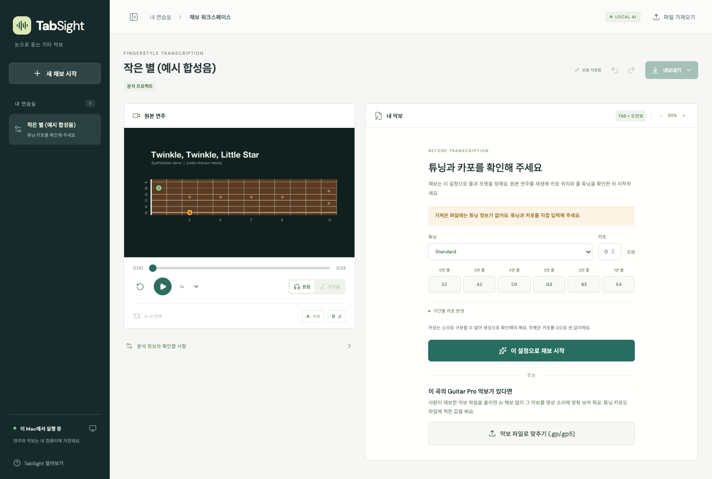
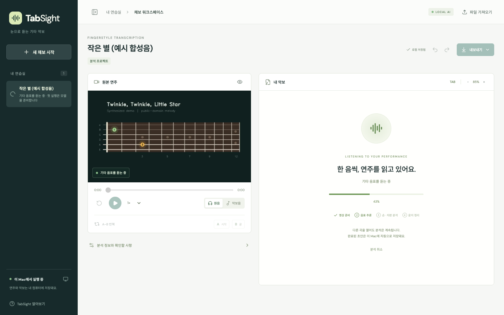
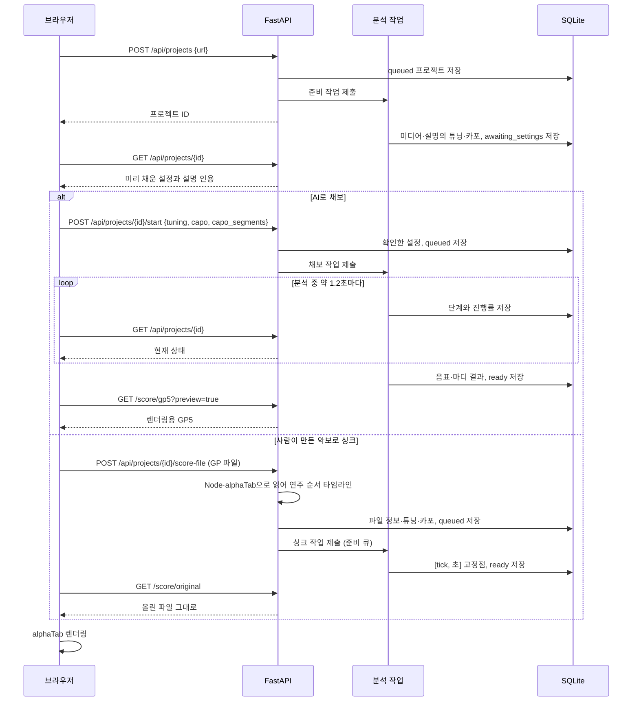
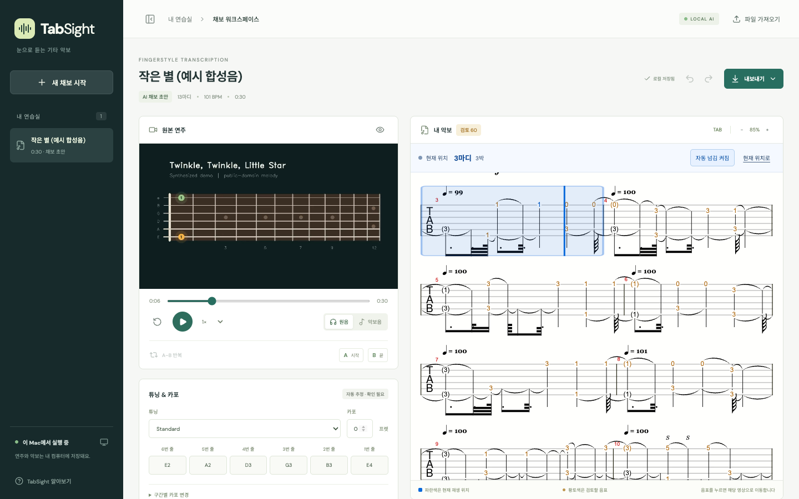

# 구조와 동작 과정

기준: 2026-10-01 구현. [README](../README.md) · [알고리즘](algorithms.md) · [개발 안내](development.md)

TabSight는 한 사람이 자신의 Mac에서 사용하는 웹앱이다. 브라우저는 편집과 재생을 담당하고, 로컬 Python 서버는 모델 추론·악보 싱크·프로젝트 저장·파일 생성을 담당한다. 현재 계정, 클라우드 작업 큐, 여러 사용자를 위한 서비스 운영 기능은 없다.

## 1. 전체 구성



왼쪽 영상은 YouTube iframe이 아니라 내려받은 영상을 재생하는 HTML `video`다. 영상은 재생에만 쓰고 채보를 위해 분석하지 않는다. 악보를 맞출 때도 영상의 소리(음성 파일)만 쓴다. 음성 파일만 가져오면 `audio`를 사용한다. 원본 YouTube 페이지는 별도 링크로 열 수 있다.

배포용 화면은 Vite로 `dist/`에 빌드하고 FastAPI가 제공한다. 개발 중에는 Vite의 5173 포트에서 화면을 열며 `/api` 요청을 8787로 전달한다. Python 서버가 시작할 때 `dist/`가 존재해야 배포용 화면이 연결된다.

## 2. URL 입력부터 초안 완성까지

1. **프로젝트 생성**: 서버가 YouTube 주소에서 11자리 영상 ID를 검증하고 프로젝트를 `queued` 상태로 저장한다. 브라우저에 프로젝트 ID를 돌려주고 준비 큐에 넣는다.
2. **미디어 준비**: yt-dlp로 영상을 내려받고 제목·채널·설명을 보관한다. FFmpeg로 16kHz 모노 WAV와 미리보기 이미지를 만든다. 설명에서 튜닝·카포를 읽어 설정 칸을 미리 채우고 `awaiting_settings`로 멈춘다.
3. **설정 확인**: 사용자가 원본 영상을 재생하며 튜닝·카포를 확인하거나 고친 뒤 채보를 시작한다. 설명에서 튜닝을 찾지 못하면 칸을 비워 두며, 튜닝과 카포를 입력해야 시작할 수 있다. 확인한 값은 `POST /start`로 저장되고 채보 큐에 들어간다.
4. **음표 추론**: GAPS 체크포인트를 처음 필요할 때 내려받고 메모리에 로드한다. 음성을 나누어 음높이, 시작·끝, 세기를 추론한다.
5. **악보 골격 생성**: 비트를 추적해 4/4 마디 초안을 만든다.
6. **운지와 주법 정리**: 확인한 튜닝·카포로 음높이를 유지한 채 연주 가능한 줄·프렛을 고르고, 신호·운지 규칙으로 주법 후보를 표시한다. 배치하지 못한 음이 반복되면 더 맞는 튜닝을 제안만 하고 설정은 바꾸지 않는다.
7. **완료**: 결과를 저장하고 `ready`로 바꾼다. 브라우저가 미리보기 GP5를 요청해 alphaTab으로 표시한다. `ready`는 초안 생성 완료를 뜻하며 정답 검증 완료를 뜻하지 않는다.

사람이 만든 악보가 있으면 3단계에서 채보 대신 싱크를 고른다.

- **3a. 악보 파일로 맞추기**: 확인 화면에서 GP 파일(.gp, .gpx, .gp5, .gp4, .gp3, 20MB 이하)을 올린다. 서버는 요청 안에서 Node와 alphaTab으로 파일을 읽어 연주 순서 타임라인을 만든다. 읽을 수 없거나 기타 트랙·음표가 없으면 바로 거절한다. 튜닝·카포는 파일 값으로 채우고 `queued`로 바꿔 준비 큐에 넣는다. 모델을 쓰지 않으므로 다른 곡의 채보를 기다리지 않는다.
- **3b. 싱크**: 음성과 타임라인을 비교해 `[tick, 초]` 고정점을 만들고 몇 초 뒤 `ready`로 바꾼다. 4~6단계는 건너뛰며 AI 채보 결과는 남기지 않는다. 브라우저는 올린 파일을 그대로 받아 표시한다. 방법은 [알고리즘 문서](algorithms.md) 10절에 있다.



화면에서는 분석 과정을 영상 준비, 음표 추론, 운지 정리 세 단계로 묶어 진행률과 함께 보여 준다. 악보를 맞출 때는 영상 준비와 악보 맞추기 두 단계다. 영상 준비가 끝나면 진행 화면 대신 설정 확인 화면이 나타나고, 연습실 목록에는 `튜닝·카포를 확인해 주세요`가 표시된다.

YouTube 곡은 영상을 내려받기 전까지 미디어 주소가 404를 돌려준다. 이때 만든 `video`는 오류 상태로 남아 다시 요청하지 않으므로, 준비 중에는 원본 영상 칸에 안내만 보이고 준비가 끝난 뒤 `video`를 만든다. 그래서 설정 확인 화면에서 새로고침 없이 영상을 재생할 수 있다. 가져온 영상·음성 파일은 프로젝트를 돌려주기 전에 저장·변환을 마치므로 처음부터 재생기를 만든다. 미리보기 이미지는 준비 중에 만들어지고 한 번 불러오지 못한 미리보기는 다시 요청하지 않으므로, 가져온 영상은 준비가 끝난 뒤에 미리보기를 붙인다.







영상 준비와 채보는 각각 `ThreadPoolExecutor(max_workers=1)`에서 순차 실행한다. 준비 큐가 따로 있어 다른 곡을 채보하는 동안에도 새 곡은 설정 확인 단계까지 진행하고, 모델 추론은 한 번에 한 곡만 한다. 악보 싱크는 모델을 쓰지 않아 준비 큐에서 실행한다. 진행률은 단계별 고정 비중이며 남은 시간 예측값이 아니다. `analysis_seconds`는 준비 작업과 채보(또는 싱크) 작업의 실행 시간 합으로, 큐에서 기다린 시간과 설정 확인을 기다린 시간은 제외한다.

## 3. 코드의 역할

| 파일 | 책임 |
|---|---|
| [src/App.tsx](../src/App.tsx) | 프로젝트 선택, 분석 상태 조회, 악보 파일 올리기, 원본 재생, A/B 반복, 저장, 실행 취소 |
| [src/Score.tsx](../src/Score.tsx) | alphaTab 연결, 악보 렌더링(앱의 GP5 또는 올린 파일), 합성음, 시간↔tick 변환(마디 또는 싱크 고정점), 악보 클릭(위치 이동·음표 선택) |
| [src/Editors.tsx](../src/Editors.tsx) | 채보 전 튜닝·카포 확인과 악보 파일 선택, 음표·마디·튜닝·카포 편집 UI, 올린 악보 정보 |
| [src/types.ts](../src/types.ts) | 프런트엔드 데이터 타입 |
| [server/app.py](../server/app.py) | HTTP API, 요청 검증, 가져오기·악보 올리기·내보내기 연결 |
| [server/pipeline.py](../server/pipeline.py) | 준비·채보·싱크 작업 큐, 미디어 준비, GAPS 실행, 단계 연결, 취소·오류 처리 |
| [server/sync.py](../server/sync.py) | 올린 악보와 음성의 크로마 비교, 반음 이동·템포 탐색, subsequence DTW, 고정점과 신뢰도 |
| [server/music.py](../server/music.py) | 설명의 튜닝·카포 읽기, 튜닝 제안, 운지 탐색, 마디, 주법 규칙 |
| [server/models.py](../server/models.py) | 프로젝트·음표·마디의 데이터 형식과 기본 검증 |
| [server/store.py](../server/store.py) | SQLite 저장, revision과 편집 이력, 데이터 경로 |
| [server/export.py](../server/export.py) | 시간 양자화, 트랙·타이·주법 구성, GP5 쓰기 |
| [scripts/score-bridge.mjs](../scripts/score-bridge.mjs) | alphaTab의 GP 읽기, GP7 변환, 반복을 펼친 연주 순서 타임라인(`timeline`)을 Node에서 실행 |

## 4. 데이터가 의미하는 것

프로젝트의 기준 데이터는 GP 파일이 아닌 `Project` JSON이다. GP5/GP와 화면 악보는 이 데이터에서 생성한다. 예외는 사람이 만든 악보를 올려 싱크한 곡으로, 올린 파일이 기준이고 JSON에는 고정점과 파일 정보만 있다(`notes`·`bars`는 비어 있음).

| 항목 | 의미와 단위 |
|---|---|
| `notes[].midi` | 실제 울리는 음높이. 일반 음에서는 튜닝+카포+프렛과 일치해야 함 |
| `notes[].start / end` | 원본 미디어 시작부터의 초. `end > start` |
| `notes[].string` | 1번=가장 가는 줄, 6번=가장 굵은 줄. 0은 운지 미정 또는 타격음 |
| `notes[].fret` | 카포 기준 상대 프렛 0~24. 하모닉스에서는 터치 프렛 |
| `tuning` | **6번→1번 줄** 순서의 개방현 MIDI. Standard는 `[40,45,50,55,59,64]` |
| `capo / capo_segments` | 기본 카포 0~12와 특정 시각부터 적용할 카포. 해당 시각 이전의 가장 최근 구간 사용 |
| `bars` | 각 마디의 실제 시작·끝 초, 박자, 템포 |
| `confidence / reviewed` | 검토 우선순위를 위한 값 / 사용자가 검토했는지 여부. 튜닝·카포 재계산으로 누르는 자리가 바뀌면 해제 |
| `evidence` | `audio`, `technique-candidate`, `manual` 등 추정·수정 근거. 이전 버전 분석에는 `vision`이 남아 있을 수 있음 |
| `metadata / metrics` | 원본 설명과 설정 출처 / 분석 실행 시의 집계. `detected_settings`는 설명에서 읽은 튜닝·카포와 그 줄, `settings_confirmed`는 채보 전 확인 여부, `tuning_source`·`capo_source`는 `description`(설명 값 그대로), `manual`(직접 입력·수정), `score`(올린 악보 파일의 값), `suggested_tuning`은 확인한 설정으로 배치하지 못한 음이 반복될 때의 제안. 이전 버전 분석에는 `audio-inference`, `settings_source`가 남아 있을 수 있음 |
| `sync` | 올린 악보로 싱크한 곡의 `[alphaTab 연주 tick, 원본 초]` 고정점. tick은 반복을 펼친 연주 순서 축이며 tick과 초가 모두 증가. 채보한 곡은 빈 목록 |
| `metadata.score_file` | 올린 파일의 원래 이름, 저장 파일(`score.<확장자>`), 제목·아티스트, 표시·비교한 트랙 번호와 이름, 트랙 수, 튜닝(줄 수대로), 카포, 마디 수, 템포 |
| `metrics.sync` | 싱크 결과: `shift`(영상이 파일보다 높은 반음 수), `match`, `contrast`, `reliable`, `start`·`end`(악보 처음과 끝의 원본 초), `tempo_ratio`(1보다 크면 연주가 파일 템포보다 빠름), `fps` |
| `revision` | 편집 충돌 방지와 화면 갱신에 쓰는 버전 번호 |

일반 음의 관계는 `midi = tuning[6 - string] + capo_at(start) + fret`다. 같은 음높이의 여러 운지를 탐색하는 과정은 [알고리즘 문서](algorithms.md)에 설명한다.

`metrics`와 `analysis-report.json`은 분석 완료 당시의 집계다. 이후 음표를 수정하거나 튜닝·카포를 바꿔도 집계를 다시 계산하지 않는다. 현재 편집 결과를 확인할 때는 `notes`, `bars`, 설정값을 기준으로 한다.

## 5. 편집·저장·실행 취소

음표·마디 입력란은 로컬 초안을 편집한다. 저장 버튼을 누르면 전체 프로젝트 JSON을 `PUT`으로 보내며 서버가 음높이/운지 일치와 마디 중복 등을 검증한다. 튜닝·카포 변경은 별도 API에서 운지를 재계산한 뒤 저장한다.

서버는 수정 전 JSON을 SQLite `history`에 넣고 `revision`을 올린다. 일반 저장 요청의 revision이 현재 값과 다르면 HTTP 409로 거절하므로 오래된 화면이 최신 변경을 덮어쓰지 않는다. 분석 진행률 저장은 편집 이력을 만들거나 revision을 올리지 않는다.

화면의 실행 취소/다시 실행은 브라우저 메모리에 둔 프로젝트 스냅샷으로 동작한다. 취소도 이전 스냅샷을 새 변경으로 저장한다. SQLite에 이력이 남아 있어도 **새로고침 후 실행 취소 목록을 복원하는 UI는 구현되어 있지 않다.** 저장된 최신 프로젝트는 유지된다.

카포·튜닝 재계산은 기존 MIDI를 유지한다. 화면은 적용 전에 새 설정의 음역을 벗어나는 음의 수와 원인을 보여 주고, 적용하면 그 음들을 운지 미정으로 남긴다. 누르는 자리가 바뀌거나 운지 미정이 된 음은 검토 완료 표시를 지워 다시 검토할 음에 올린다. 음표 편집기에서 프렛을 직접 바꾸는 작업은 해당 음의 MIDI도 바꾸므로 목적이 다르다.

올린 악보로 싱크한 곡은 편집할 음표가 없으므로 저장(`PUT`)과 튜닝·카포 재계산을 409로 거절하고, 화면에도 편집 패널을 두지 않는다. 악보를 고치려면 원본 파일을 고쳐 다시 올린다. `악보 바꾸기 · AI 채보로 돌아가기`는 `retry`로 올린 파일과 고정점을 지우고 튜닝·카포 확인 단계로 돌아간다. 이때 파일의 튜닝·카포를 채워 둔다.

## 6. 영상과 악보의 동기화

GP 악보는 tick, 원본 영상은 초를 사용한다. [Score.tsx](../src/Score.tsx)는 각 마디 안에서 다음처럼 선형 변환한다.

```text
ratio = (영상 시간 - 마디 시작 초) / (마디 끝 초 - 마디 시작 초)
tick  = alphaTab 마디 시작 tick + ratio × alphaTab 마디 길이 tick
```

역변환으로 합성음의 위치를 원본 시간으로 바꾼다. 원음 모드에서는 영상의 시간 갱신이 악보 커서를 움직인다. 합성음 모드에서는 alphaTab이 재생을 주도하고 영상은 일시정지한 채 해당 위치로 탐색된다. 두 오디오를 동시에 재생하는 방식은 아니다.

올린 악보로 싱크한 곡은 마디 대신 `sync` 고정점 사이를 선형 보간해 초↔tick을 바꾼다. tick은 반복을 펼친 연주 순서 축이라 반복 구간의 두 번째 연주도 따로 대응된다. 반복되는 마디를 누르면 그 마디가 연주되는 시점 중 현재 위치에 가장 가까운 곳으로 가고, 상단의 마디·박은 alphaTab의 tick 조회에서 읽은 악보의 마디 번호다. 악보음은 파일에 적힌 템포로 연주하고 영상이 그 위치를 따라가므로, 연주자의 템포와는 다를 수 있다.

원음 모드에서는 alphaTab의 합성기가 일시정지 상태이므로 내장 재생 강조·스크롤만으로는 충분하지 않다. `tickCache.findBeat`와 렌더러의 마디 좌표를 사용해 두 재생 모드에 공통으로 음표 강조와 자동 넘김을 적용한다. 파란 배경은 현재 마디, 진한 세로선은 재생 위치이며 상단에 마디·박을 표시한다. 악보 줄이 바뀔 때 `.score-scroll` 내부만 이동한다. 자동 넘김을 끌 수 있고, `현재 위치로` 버튼은 현재 줄로 즉시 복귀한다.



alphaTab의 재생선은 CSS transform으로 크기가 조정되므로 `width: 2px !important`처럼 너비를 강제하면 화면에서는 선이 거의 사라진다. 라이브러리가 계산한 너비를 유지하고 색상만 지정한다. [공식 커서 스타일 문서](https://docs.alphatab.net/docs/guides/styling-player)를 참고했다. 창 크기가 바뀌면 악보 폭 500px 미만에서는 한 줄에 한 마디, 그 이상에서는 두 마디로 재배치하며 재생 위치를 복원한다.

악보를 누르면 누른 자리의 박이 시작하는 시간을 계산해, 원음·악보음 모드 모두 원본과 악보 위치를 그곳으로 옮긴다. 숫자(음표)를 누르면 같은 줄에서 시작 시간이 가까운 원본 음표도 찾아 선택하고 그 음의 시작으로 이동한다. 현재 허용 범위는 0.3초다. 렌더링된 타이 조각이 원본 음표 하나와 완전히 일대일로 대응하지는 않으므로, 앞 마디에서 길게 이어지는 붙임줄 숫자처럼 범위 안에 원본 음표가 없으면 선택 없이 그 위치로만 이동한다. 원음 모드에서 누른 채 앞쪽으로 끌어 구간을 선택하면 영상은 처음 누른 박으로 가지만 alphaTab은 커서를 놓은 박(구간 시작)에 둔다. 재생하면 커서가 영상 위치로 돌아온다.

마디 템포·박자를 수정하면 마디 경계를 다시 계산한다. 이때 음표의 원본 시작·끝 초는 그대로 유지한다. GP 출력의 리듬 양자화와 정수 BPM 때문에 원본과 출력 파일 길이가 조금 달라질 수 있다.

## 7. 저장 위치

기본 위치는 프로젝트 루트의 `.data/`다. 서버 시작 전에 `TABSIGHT_DATA_DIR`를 설정하면 바꿀 수 있다. 입력 종류나 분석 성공 여부에 따라 파일 일부만 존재할 수 있다.

```text
.data/
├── tabsight.sqlite3             # 프로젝트 JSON과 revision별 편집 이력
├── models/
│   └── gaps/                   # GAPS 체크포인트와 다운로드 메타데이터
└── projects/<project-id>/
    ├── source.mp4 / audio.wav / poster.jpg
    ├── source.info.json        # YouTube 다운로드 정보
    ├── import.<확장자>          # 가져온 원본; MP4는 source.mp4로 이동
    ├── score.<확장자>           # 영상에 맞추려고 올린 악보 파일 (그대로 보관·표시)
    ├── score.timeline.json     # 그 악보의 연주 순서 타임라인 (싱크 입력)
    └── analysis-report.json    # 완료 시 실행시간과 집계 (싱크한 곡은 싱크 결과)
```

이전 버전으로 분석한 프로젝트 폴더에는 `audio-only.json`, `vision-result.json`, `vision.log`가, `models/`에는 `hand_landmarker.task`가 남아 있을 수 있다. 현재 앱은 이 파일들을 읽지 않는다.

편집된 최신 음표는 SQLite 프로젝트에 저장된다. 위 분석 산출물을 모두 최신 편집본으로 덮어쓰지는 않는다. `test-results/`는 개발 중 검사 결과이며 앱 실행의 필수 입력은 아니다.

백업은 서버를 종료한 뒤 `.data/` 전체를 복사한다. SQLite가 WAL을 사용하므로 실행 중 `.sqlite3` 한 파일만 복사하는 방식은 피한다. JSON 내보내기를 앱에 다시 불러오는 기능은 아직 없다.

## 8. API 요약

서버 실행 후 [자동 생성 API 문서](http://127.0.0.1:8787/api/docs)에서 정확한 요청 스키마를 볼 수 있다. 아래의 `{id}`는 프로젝트 ID다.

| 메서드·경로 | 동작 |
|---|---|
| `GET /api/health` | 서버 상태, 튜닝 프리셋, GAPS 파일 캐시 여부 |
| `GET /api/projects` | 프로젝트 요약 목록 |
| `POST /api/projects` | `{url}`로 준비 작업 생성. 미디어 준비 후 `awaiting_settings`에서 멈춤 |
| `GET /api/projects/{id}` | 전체 프로젝트 조회 |
| `PUT /api/projects/{id}` | revision을 포함한 프로젝트 편집 저장. 올린 악보로 싱크한 곡은 409 |
| `DELETE /api/projects/{id}` | 프로젝트·편집 이력·`projects/<id>/` 폴더 삭제. 분석 중이면 409 |
| `POST /api/projects/{id}/start` | 확인한 `{tuning, capo, capo_segments}`로 채보 시작. `awaiting_settings`가 아니면 409, 범위를 벗어난 값은 422 |
| `POST /api/projects/{id}/score-file` | multipart `file`(.gp, .gpx, .gp5, .gp4, .gp3, 20MB 이하)을 영상에 맞추는 싱크 작업 시작. `awaiting_settings`가 아니면 409, 읽을 수 없거나 기타 트랙·음표가 없으면 422 |
| `POST /api/projects/{id}/cancel` | 취소 요청 |
| `POST /api/projects/{id}/retry` | 다시 준비해 설정 확인 단계로. 이전에 확인한 설정을 채워 둠. 싱크한 곡은 올린 파일과 고정점을 지움 |
| `POST /api/projects/{id}/revoice` | 튜닝·카포·구간별 카포 변경과 운지 재계산. 배치할 수 없는 음은 `allow_unplayable`이 참이면 운지 미정으로 남기고, 아니면 원인과 함께 422. 싱크한 곡은 409 |
| `GET /api/projects/{id}/media/{kind}` | `video`, `audio`, `poster` 제공 |
| `GET /api/projects/{id}/score/{fmt}` | `gp5`, `gp`, `json` 생성. `original`은 올린 악보 파일을 원래 이름으로 제공 |
| `POST /api/import` | multipart `file`로 악보·미디어 가져오기, 최대 1GB |

`preview=true`인 GP 요청은 미정 운지를 제외하고 일부 충돌 검사를 생략하여 편집 중 화면을 표시한다. 따라서 화면에 악보가 보이는 것만으로 실제 내보내기 검증을 통과했다고 볼 수 없다.

## 9. 실패·재시작·가져오기

- 정상 상태는 `queued → processing → awaiting_settings → queued → processing → ready`, 중단은 `cancelled`, 실패는 `error`다. 앞의 `processing`은 영상 준비, 뒤는 채보 또는 악보 싱크다. 취소는 다운로드 훅·추론 청크 경계·싱크 계산 전후 등 다음 확인 지점에서 적용되므로 즉시 끝나지 않을 수 있다.
- MPS에서 추론 중 `RuntimeError` 또는 `NotImplementedError`가 발생하면 같은 모델을 CPU로 옮겨 해당 청크를 다시 계산한다. 모든 종류의 실패를 복구한다는 뜻은 아니다.
- 서버를 재시작할 때 남아 있는 `queued`·`processing` 작업은 오류 상태로 전환한다. `awaiting_settings`는 사용자를 기다리는 상태이므로 그대로 둔다. 다시 분석하면 남은 미디어를 활용해 설정 확인 단계로 돌아가며, 채보는 **추론 청크부터 이어서 재개하지 않고 다시 계산**한다. 재분석은 기존 초안과 편집 내용을 대체할 수 있다.
- GP/GP5/GP4/GP3 가져오기는 모델 추론 없이 기존 악보를 읽는다. 첫 기타 트랙을 편집 모델로 변환하며 여러 트랙·반복 구조를 완전히 보존하는 왕복 편집기는 아니다. 편집 모델은 3, 4, 5, 7, 9, 12프렛의 자연 하모닉스만 표현하므로, 그 프렛과 음높이에 맞지 않는 하모닉스(다른 프렛의 자연 하모닉스와 대부분의 인공·탭·핀치 하모닉스)는 누르는 프렛의 일반 음으로 가져와 검토할 음에 올리고 경고로 알린다. 7프렛에서 한 옥타브 위를 내는 인공·핀치 하모닉스처럼 같은 프렛의 자연 하모닉스와 음높이가 같으면 자연 하모닉스로 가져온다. 벤딩은 높이를 읽지 않고 주법만 가져오므로, 다시 내보내면 반음 벤딩이 된다. 붙임줄로 나뉜 음의 해머온·풀오프·슬라이드는 마지막 조각에 적혀 있어도 그 음의 주법으로 읽는다. TabSight가 내보내는 파일도 그렇게 적는다. 원본과 AI 결과를 구분해 표시한다. 영상 없이 악보만 볼 때의 경로이고, 영상에 맞춰 보려면 영상을 준비한 뒤 튜닝·카포 확인 화면에서 악보를 올린다(2절 3a). 그쪽은 파일을 변환하지 않고 그대로 표시한다.
- 영상·음성 가져오기는 파일 변환 후 준비 큐에 넣는다. 설명이 없으므로 설정 확인 단계에서 튜닝과 카포를 직접 입력한다. 변환 일부는 가져오기 HTTP 요청 안에서 실행되므로 큰 파일에서는 응답이 늦을 수 있다.
- 가져오기(GP와 영상·음성 모두)와 확인 화면의 악보 올리기는 서버의 스레드 풀에서 처리된다. 변환하는 동안에도 진행률 조회와 다른 곡의 재생은 멈추지 않는다.
